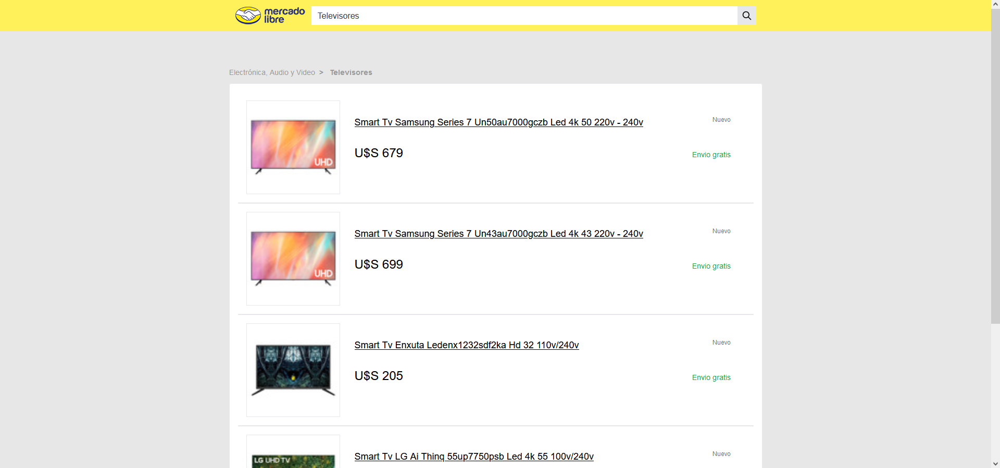
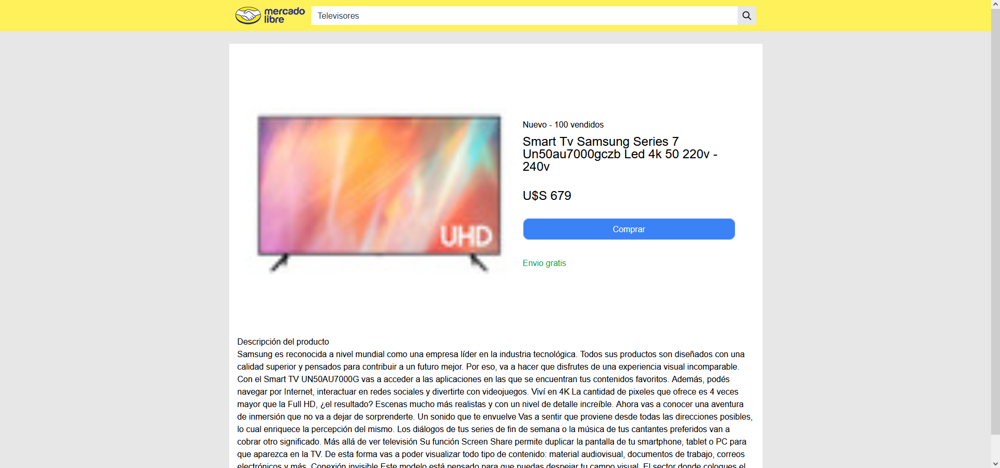
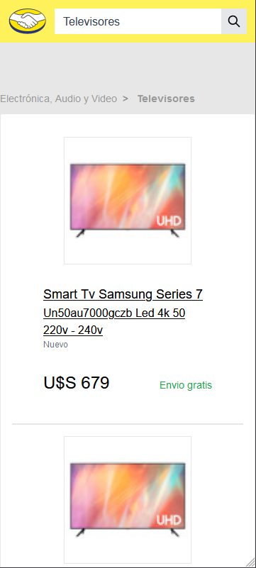
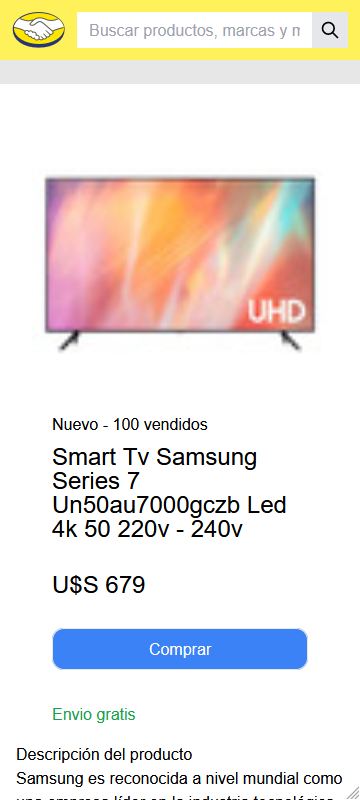

# MercadoLibre Challenge - Web

    <table>
        <tbody align="center">
            <tr>
                <td style="width:30%">
                    <a href="https://bit.ly/awesome-go-doppler">
                         
                    </a>
                </td>
                 <td style="width:30%">
                    <a href="https://bit.ly/awesome-go-doppler">
                         
                    </a>
                </td>
            </tr>
        </tbody>
    </table>

##### *React image by Facebook under [Creative Commons Attribution 4.0 license][cc4-by].*
##### *Mercado Libre logo by Mercado Libre LLC under [Mercado Libre Terms & Conditions/9-Interactual property][meli-term-and-conditions].*

## Introduction
This was a project made on [React](https://reactjs.org/) for the propose of consume the data from our custom API using with [MercadoLibre API](https://api.mercadolibre.com/). Some app features: 

* SEO implementation through a custom hook. 
* Responsive design.
* Type safety using TypeScript
* Components aproach for maximaze re-usability.

## Installation
* Clone repo
* `npm install`
* `npm start`

## Dependencies
* [Tailwind](https://tailwindcss.com/): UI Framework.
* [SASS](https://sass-lang.com/): CSS with superpowers.
* [Axios](https://axios-http.com/): To perform Http requests to the API endpoints.
* [React Query](https://tanstack.com/): Asynchronous synchronizing state management for handling upcoming data, also handles caching.
* [I18next](https://www.i18next.com/): Internationalization Framework to handle some enums data and format them easy.
* [dotenv](https://www.npmjs.com/package/dotenv): To handle environment variables. 

Reasons behind uses of some dependencies:

* React Query: Handles data queries and caching for the application very well. To be more specific, for example, each time a user checks an Item/Product, it will cache the data. So, if this user re-enters the page automatically is gonna retrieves data from the cache and not from the API again. The default cache is 5 minutes after that this specific request *ages* and forces the application to recover data from the backend again. With this method, we can avoid unnecessary API requests and have more likeable UX.

## UI Screenshots

    <table>
        <tbody align="center">
            <tr>
                <td style="width:50%">
                     
                </td>
                <td style="width:100%">
                     
                </td>
            </tr>
             <tr>
                <td style="width:50%">
                     
                </td>
                <td style="width:100%">
                     
                </td>
            </tr>
        </tbody>
    </table>

[cc4-by]: https://github.com/reactjs/reactjs.org/blob/main/LICENSE-DOCS.md
[meli-term-and-conditions]: https://www.mercadolibre.com.ar/ayuda/terminos-y-condiciones-de-uso_991

